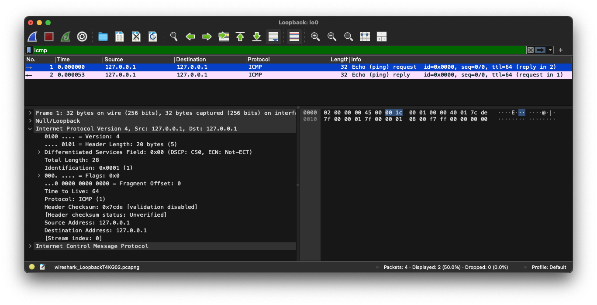

# TEB2093 Computer Security - Lab 01

## Members

- Ammar Farhan Bin Mohamad Rizam (22006911)
- Amisya Fareezan Binti Mohd Fadhil (22007082)
- Ahmad Anas Bin Azhar (22005996)
- Muhammad Hanis Afifi Bin Azmi (22001602)

## Quick Guide

To install dependencies, run:

```bash
pip install -r requirements.txt
```

To see sniffing options:

```bash
./sniffer.py --help
```

To see spoofing options:

```bash
./spoofer.py --help
```

To see traceroute options:

```bash
./traceroute.py --help
```

To see sniff-and-then-spoof options:

```bash
./sniff_and_spoof.py --help
```

## Task 1.1: Sniffing Packets

```py
#!/usr/bin/python3
from scapy.all import *

def print_pkt(pkt):
    pkt.show()

pkt = sniff(filter='icmp',prn=print_pkt)
```

### Task 1.1A

The above program sniffs packets. For each captured packet, the callback function `print_pkt()` will be invoked; this function will print out some of the information about the packet. Run the program with the root privilege and demonstrate that you can indeed capture packets. After that, run the program again, but without using the root privilege; describe and explain your observations.

```bash
# Make the program executable
$ chmod a+x sniffer.py

# Run the program with the root privilege
$ sudo ./sniffer.py
```

**Output:**

```txt
[*] Sniffing with filter "icmp"...

###[ Ethernet ]###
  dst       = 00:1c:42:00:00:18
  src       = 00:1c:42:4f:6c:63
  type      = IPv4
###[ IP ]###
     version   = 4
     ihl       = 5
     tos       = 0x0
     len       = 84
     id        = 16187
     flags     = DF
     frag      = 0
     ttl       = 64
     proto     = icmp
     chksum    = 0xa987
     src       = 10.211.55.4
     dst       = 8.8.8.8
     \options   \
###[ ICMP ]###
        type      = echo-request
        code      = 0
        chksum    = 0x582b
        id        = 0x2022
        seq       = 0x1
        unused    = ''
###[ Raw ]###
           load      = '\\xe7ݏg\x00\x00\x00\x00=\\x99\x0c\x00\x00\x00\x00\x00\x10\x11\x12\x13\x14\x15\x16\x17\x18\x19\x1a\x1b\x1c\x1d\x1e\x1f !"#$%&\'()*+,-./01234567'

###[ Ethernet ]###
  dst       = 00:1c:42:4f:6c:63
  src       = 00:1c:42:00:00:18
  type      = IPv4
###[ IP ]###
     version   = 4
     ihl       = 5
     tos       = 0x0
     len       = 84
     id        = 47572
     flags     =
     frag      = 0
     ttl       = 128
     proto     = icmp
     chksum    = 0x2eee
     src       = 8.8.8.8
     dst       = 10.211.55.4
     \options   \
###[ ICMP ]###
        type      = echo-reply
        code      = 0
        chksum    = 0x602b
        id        = 0x2022
        seq       = 0x1
        unused    = ''
###[ Raw ]###
           load      = '\\xe7ݏg\x00\x00\x00\x00=\\x99\x0c\x00\x00\x00\x00\x00\x10\x11\x12\x13\x14\x15\x16\x17\x18\x19\x1a\x1b\x1c\x1d\x1e\x1f !"#$%&\'()*+,-./01234567'
```

**Observation:** ICMP `echo-request` packet is sent from VM to `8.8.8.8`. `8.8.8.8` replies with `echo-reply` back to VM. These exchanges were triggered manually via `ping -c 1 8.8.8.8` command.

```bash
# Run the program without the root privilege
$ ./sniffer.py
```

**Output:**

```txt
[*] Sniffing with filter "icmp"...

Traceback (most recent call last):
  File "./sniffer.py", line 79, in <module>
    main()
  File "./sniffer.py", line 75, in main
    sniff(filter=sniff_filter, prn=lambda packet: packet.show())
  File "/usr/lib/python3/dist-packages/scapy/sendrecv.py", line 1311, in sniff
    sniffer._run(*args, **kwargs)
  File "/usr/lib/python3/dist-packages/scapy/sendrecv.py", line 1171, in _run
    sniff_sockets[_RL2(iface)(type=ETH_P_ALL, iface=iface,
                  ^^^^^^^^^^^^^^^^^^^^^^^^^^^^^^^^^^^^^^^^
  File "/usr/lib/python3/dist-packages/scapy/arch/linux.py", line 484, in __init__
    self.ins = socket.socket(
               ^^^^^^^^^^^^^^
  File "/usr/lib/python3.12/socket.py", line 233, in __init__
    _socket.socket.__init__(self, family, type, proto, fileno)
PermissionError: [Errno 1] Operation not permitted
```

**Observation:** Sniffing packets requires reading from existing socket connections (file descriptors). In Linux, only priviledged users are able to tap into opened connections by other programs.

### Task 1.1B

Please set the following filters and demonstrate your sniffer program again (each filter should be set separately):

- Capture only `ICMP` packet.

    ```bash
    $ ./sniffer.py --sniff-protocol ICMP
    ```

    **Output:**

    ```txt
    [*] Sniffing with filter "icmp"...

    ###[ Ethernet ]###
    dst       = 00:1c:42:00:00:18
    src       = 00:1c:42:4f:6c:63
    type      = IPv4
    ###[ IP ]###
        version   = 4
        ihl       = 5
        tos       = 0x0
        len       = 84
        id        = 16187
        flags     = DF
        frag      = 0
        ttl       = 64
        proto     = icmp
        chksum    = 0xa987
        src       = 10.211.55.4
        dst       = 8.8.8.8
        \options   \
    ###[ ICMP ]###
            type      = echo-request
            code      = 0
            chksum    = 0x582b
            id        = 0x2022
            seq       = 0x1
            unused    = ''
    ###[ Raw ]###
            load      = '\\xe7ݏg\x00\x00\x00\x00=\\x99\x0c\x00\x00\x00\x00\x00\x10\x11\x12\x13\x14\x15\x16\x17\x18\x19\x1a\x1b\x1c\x1d\x1e\x1f !"#$%&\'()*+,-./01234567'

    ###[ Ethernet ]###
    dst       = 00:1c:42:4f:6c:63
    src       = 00:1c:42:00:00:18
    type      = IPv4
    ###[ IP ]###
        version   = 4
        ihl       = 5
        tos       = 0x0
        len       = 84
        id        = 47572
        flags     =
        frag      = 0
        ttl       = 128
        proto     = icmp
        chksum    = 0x2eee
        src       = 8.8.8.8
        dst       = 10.211.55.4
        \options   \
    ###[ ICMP ]###
            type      = echo-reply
            code      = 0
            chksum    = 0x602b
            id        = 0x2022
            seq       = 0x1
            unused    = ''
    ###[ Raw ]###
            load      = '\\xe7ݏg\x00\x00\x00\x00=\\x99\x0c\x00\x00\x00\x00\x00\x10\x11\x12\x13\x14\x15\x16\x17\x18\x19\x1a\x1b\x1c\x1d\x1e\x1f !"#$%&\'()*+,-./01234567'
    ```

- Capture any `TCP` packet that comes from a particular IP and with a destination port number `23`.

    ```bash
    $ ./sniffer.py --sniff-protocol TCP --sniff-source-ip 172.29.85.86 --sniff-source-port 23
    ```

    **Output:**

    ```txt
    [*] Sniffing with filter "tcp and src host 172.29.85.86 and dst port 23"...

    ###[ Ethernet ]###
    dst       = 00:1c:42:4f:6c:63
    src       = 82:89:af:c8:d0:86
    type      = IPv4
    ###[ IP ]###
        version   = 4
        ihl       = 5
        tos       = 0x10
        len       = 64
        id        = 0
        flags     = DF
        frag      = 0
        ttl       = 64
        proto     = tcp
        chksum    = 0x366c
        src       = 172.29.85.86
        dst       = 172.29.86.171
        \options   \
    ###[ TCP ]###
            sport     = 49859
            dport     = telnet
            seq       = 1083538799
            ack       = 0
            dataofs   = 11
            reserved  = 0
            flags     = S
            window    = 65535
            chksum    = 0x20d1
            urgptr    = 0
            options   = [('MSS', 1460), ('NOP', None), ('WScale', 6), ('NOP', None), ('NOP', None), ('Timestamp', (3647649700, 0)), ('SAckOK', b''), ('EOL', None)]
    ```

- Capture packets coming from or going to a particular subnet. You can pick any subnet, such as `128.230.0.0/16`; you should not pick the subnet that your VM is attached to.

    ```bash
    $ ./sniffer.py --sniff-source-ip 172.29.80.0 --sniff-source-subnet 21 --sniff-destination-ip 172.29.80.0 --sniff-destination-subnet 21
    ```

    **Output:**

    ```txt
    [*] Sniffing with filter "net 172.29.80.0/21"...

    ###[ Ethernet ]###
    dst       = 00:e0:4c:68:09:df
    src       = cc:d3:42:8e:c6:82
    type      = IPv4
    ###[ IP ]###
        version   = 4
        ihl       = 5
        tos       = 0x0
        len       = 84
        id        = 47203
        flags     = DF
        frag      = 0
        ttl       = 58
        proto     = icmp
        chksum    = 0x846d
        src       = 172.29.86.171
        dst       = 172.16.84.255
        \options   \
    ###[ ICMP ]###
            type      = echo-request
            code      = 0
            chksum    = 0x734
            id        = 0x1644
            seq       = 0x1
            unused    = b''
    ###[ Raw ]###
            load      = b'\xe7\x00\x90g\x00\x00\x00\x00\x9bK\t\x00\x00\x00\x00\x00\x10\x11\x12\x13\x14\x15\x16\x17\x18\x19\x1a\x1b\x1c\x1d\x1e\x1f !"#$%&\'()*+,-./01234567'

    ###[ Ethernet ]###
    dst       = cc:d3:42:8e:c6:82
    src       = 00:e0:4c:68:09:df
    type      = IPv4
    ###[ IP ]###
        version   = 4
        ihl       = 5
        tos       = 0x0
        len       = 84
        id        = 0
        flags     = DF
        frag      = 0
        ttl       = 64
        proto     = icmp
        chksum    = 0x36d1
        src       = 172.16.84.255
        dst       = 172.29.86.171
        \options   \
    ###[ ICMP ]###
            type      = echo-reply
            code      = 0
            chksum    = 0xf34
            id        = 0x1644
            seq       = 0x1
            unused    = b''
    ###[ Raw ]###
            load      = b'\xe7\x00\x90g\x00\x00\x00\x00\x9bK\t\x00\x00\x00\x00\x00\x10\x11\x12\x13\x14\x15\x16\x17\x18\x19\x1a\x1b\x1c\x1d\x1e\x1f !"#$%&\'()*+,-./01234567'
    ```

## Task 1.2: Spoofing ICMP Packets

```py
from scapy.all import *

a = IP()
a.dst = "10.0.2.3"
b = ICMP()
p = a / b
send(p)
```

Please make any necessary change to the sample code, and then demonstrate that you can spoof an ICMP echo request packet with an arbitrary source IP address.

### When IP is not spoofed

```bash
$ ./spoofer.py --spoof-destination-ip 127.0.0.1
```

**Output:**

```txt
[*] Spoofer: source IP 127.0.0.1...
[*] Spoofer: destination IP 127.0.0.1...
.
Sent 1 packets.
```



### When IP is spoofed

```bash
$ ./spoofer.py --spoof-source-ip 192.168.69.69 --spoof-destination-ip 127.0.0.1
```

**Output:**

```txt
[*] Spoofer: source IP from 127.0.0.1 to 192.168.69.69...
[*] Spoofer: destination IP 127.0.0.1...
.
Sent 1 packets.
```


## Task 1.3: Traceroute

The objective of this task is to use Scapy to estimate the distance, in terms of number of routers, between your VM and a selected destination. This is basically what is implemented by the traceroute tool. In this task, we will write our own tool. The idea is quite straightforward: just send an packet (any type) to the destination, with its Time-To-Live (TTL) field set to 1 first. This packet will be dropped by the first router, which will send us an ICMP error message, telling us that the time-to-live has exceeded. That is how we get the IP address of the first router. We then increase our TTL field to 2, send out another packet, and get the IP address of the second router. We will repeat this procedure until our packet finally reach the destination. It should be noted that this experiment only gets an estimated result, because in theory, not all these packets take the same route (but in practice, they may within a short period of time). The code in the following shows one round in the procedure.

```py
from scapy.all import *

a = IP()
a.dst = '1.2.3.4'
a.ttl = 3
b = ICMP()
send(a/b)
```

If you are an experienced Python programmer, you can write your tool to perform the entire procedure automatically. If you are new to Python programming, you can do it by manually changing the TTL field in each round, and record the IP address based on your observation from Wireshark. Either way is acceptable, as long as you get the result.

```bash
$ ./traceroute.py --traceroute-destination-ip 8.8.8.8 --traceroute-start-ttl 1 --traceroute-end-ttl 30
```

**Output:**

```txt
[+] Route set from 172.16.84.255 to 8.8.8.8...
[*] Tracing route with ICMP of TTL 1...
        [-] TTL reached at 172.16.87.254.
[*] Tracing route with ICMP of TTL 2...
        [-] TTL reached at 172.16.248.41.
[*] Tracing route with ICMP of TTL 3...
        [-] TTL reached at 172.16.248.43.
[*] Tracing route with ICMP of TTL 4...
        [-] TTL reached at 172.16.248.36.
[*] Tracing route with ICMP of TTL 5...
        [-] TTL reached at 203.135.190.12.
[*] Tracing route with ICMP of TTL 6...
        [-] TTL reached at 10.10.33.1.
[*] Tracing route with ICMP of TTL 7...
        [-] TTL reached at 203.106.84.141.
[*] Tracing route with ICMP of TTL 8...
        [-] TTL reached at 10.55.48.84.
[*] Tracing route with ICMP of TTL 9...
        [-] TTL reached at 72.14.204.118.
[*] Tracing route with ICMP of TTL 10...
        [-] TTL reached at 108.170.230.49.
[*] Tracing route with ICMP of TTL 11...
        [-] TTL reached at 142.251.224.15.
[*] Tracing route with ICMP of TTL 12...
        [+] Destination reached to 8.8.8.8!
```

`8.8.8.8`, which is Google's DNS server, is reached after 12 router hops!

## Task 1.4: Sniffing and-then Spoofing

In this task, you will combine the sniffing and spoofing techniques to implement the following sniff-and-then-spoof program. You need two VMs on the same LAN. From VM A, you ping an IP X. This will generate an ICMP echo request packet. If X is alive, the ping program will receive an echo reply, and print out the response. Your sniff-and-then-spoof program runs on VM B, which monitors the LAN through packet sniffing. Whenever it sees an ICMP echo request, regardless of what the target IP address is, your program should immediately send out an echo reply using the packet spoofing technique. Therefore, regardless of whether machine X is alive or not, the ping program will always receive a reply, indicating that X is alive. You need to use Scapy to do this task. In your report, you need to provide evidence to demonstrate that your technique works.

### Without Sniff and Spoof

```bash
$ ping -c 1 172.172.172.172
```

**Output:**

```txt
PING 172.172.172.172 (172.172.172.172): 56 data bytes

--- 172.172.172.172 ping statistics ---
1 packets transmitted, 0 packets received, 100.0% packet loss
```

### With Sniff and Spoof

```bash
$ ping -c 1 172.172.172.172
```

**Output:**

```txt
PING 172.172.172.172 (172.172.172.172): 56 data bytes
64 bytes from 172.172.172.172: icmp_seq=0 ttl=64 time=7.301 ms

--- 172.172.172.172 ping statistics ---
1 packets transmitted, 1 packets received, 0.0% packet loss
round-trip min/avg/max/stddev = 7.301/7.301/7.301/0.000 ms
```

### From Sniffer & Spoofer

```bash
$ ./sniff_and_spoof.py --sniff-interface en10 --sniff-source-ip 172.16.84.255
```

**Output:**

```txt
[*] Sniffing with filter "icmp and src host 172.16.84.255"...

[+] Detected ICMP echo-request from 172.16.84.255 to 172.172.172.172!
###[ Ethernet ]###
  dst       = cc:d3:42:8e:c6:82
  src       = 00:e0:4c:68:09:df
  type      = IPv4
###[ IP ]###
     version   = 4
     ihl       = 5
     tos       = 0x0
     len       = 84
     id        = 57750
     flags     =
     frag      = 0
     ttl       = 64
     proto     = icmp
     chksum    = 0x3eaa
     src       = 172.16.84.255
     dst       = 172.172.172.172
     \options   \
###[ ICMP ]###
        type      = echo-request
        code      = 0
        chksum    = 0x55ab
        id        = 0xa97d
        seq       = 0x0
        unused    = b''
###[ Raw ]###
           load      = b'g\x92l\xe2\x00\x089W\x08\t\n\x0b\x0c\r\x0e\x0f\x10\x11\x12\x13\x14\x15\x16\x17\x18\x19\x1a\x1b\x1c\x1d\x1e\x1f !"#$%&\'()*+,-./01234567'

[*] Spoofer: source IP from 127.0.0.1 to 172.172.172.172...
[*] Spoofer: destination IP 172.16.84.255...
[+] Spoofed packet built!
###[ IP ]###
  version   = 4
  ihl       = 5
  tos       = 0x0
  len       = 84
  id        = 1
  flags     =
  frag      = 0
  ttl       = 64
  proto     = icmp
  chksum    = 0x2040
  src       = 172.172.172.172
  dst       = 172.16.84.255
  \options   \
###[ ICMP ]###
     type      = echo-reply
     code      = 0
     chksum    = 0x5dab
     id        = 0xa97d
     seq       = 0x0
     unused    = b''
###[ Raw ]###
        load      = b'g\x92l\xe2\x00\x089W\x08\t\n\x0b\x0c\r\x0e\x0f\x10\x11\x12\x13\x14\x15\x16\x17\x18\x19\x1a\x1b\x1c\x1d\x1e\x1f !"#$%&\'()*+,-./01234567'

.
Sent 1 packets.
[+] Sent spoofed ICMP echo-reply as 172.172.172.172 to 172.16.84.255 over the interface en10!
```
